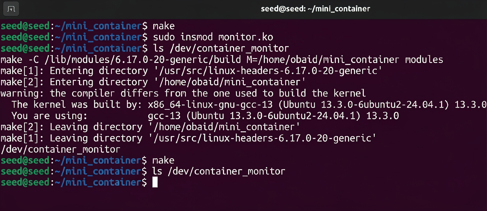
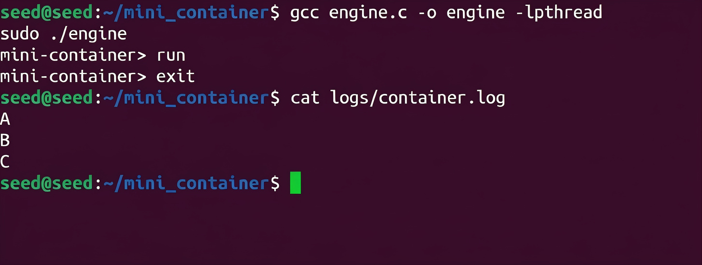
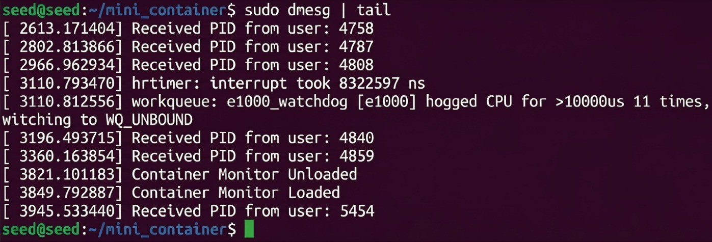
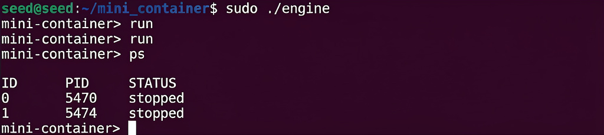

# Mini Container Runtime with Kernel Monitoring

##  Student Details
Teammate 1:-
Name: Syed Obaid Faraz  
SRN: PES2UG24CS546

Teammate 2:-
Name: Suryatej V
SRN: PES2UG24CS541
---

#  Project Overview

This project implements a **mini container runtime system** in Linux along with a **kernel monitoring module**.  
It demonstrates core operating system concepts such as process isolation, inter-process communication, logging, and kernel-user space interaction.

---

#  Features

- Container creation using `clone()`
- PID, UTS, and Mount namespace isolation
- Filesystem isolation using `chroot()`
- Logging system using pipes and threads
- Producer–Consumer synchronization
- Kernel module for process monitoring
- Communication via `ioctl()`

---

#  System Architecture

Container → Pipe → Logging System → Log File  
              ↓  
            Kernel Module (via ioctl)

---

#  Build & Run Instructions

## 1. Compile Kernel Module
```bash
make
```

## 2. Load Kernel Module
```bash
sudo insmod monitor.ko
```

## 3. Verify Device
```bash
ls /dev/container_monitor
```

## 4. Compile Engine
```bash
gcc engine.c -o engine -lpthread
```

## 5. Run Program
```bash
sudo ./engine
```

---

#  Usage

```bash
run   # start container
ps    # list containers
exit  # exit program
```

---

#  Demo Explanation

- Containers are created using `clone()` with namespaces  
- Output from containers is redirected via pipes  
- Logging system captures output and stores it in `logs/container.log`  
- Kernel module receives container PID using `ioctl()`  

---

#  Screenshots

##  Figure 1: Kernel Module Build and Device Creation


##  Figure 2: Container Execution and Logging


##  Figure 3: Kernel Receiving Process ID


##  Figure 4: Multiple Container Execution


---

#  Engineering Analysis

##  1. Isolation Mechanisms
- PID namespace ensures each container sees its own process IDs  
- UTS namespace isolates hostname  
- Mount namespace isolates filesystem  
- `chroot()` restricts container root directory  

---

##  2. Process Lifecycle
- Containers are created using `clone()`  
- Parent process tracks container metadata  
- `SIGCHLD` handler prevents zombie processes  

---

##  3. Logging System
- Pipe used for communication between container and host  
- Producer thread reads container output  
- Consumer thread writes to log file  
- Mutex and condition variables ensure synchronization  

---

## 4. Kernel Integration
- Kernel module creates `/dev/container_monitor`  
- User-space program sends PID using `ioctl()`  
- Kernel logs received PID using `printk()`  

---

#  Design Decisions

| Component | Choice | Reason |
|----------|-------|-------|
| clone() | Used | Enables namespace-based isolation |
| Pipes | Used | Simple IPC mechanism |
| Threads | Used | Efficient logging |
| Kernel module | Used | Enables low-level monitoring |

---

#  Results

- Containers executed successfully  
- Logging system captured outputs correctly  
- Kernel module received PIDs successfully  
- System remained stable and responsive  

---

# Conclusion

This project successfully demonstrates a simplified container runtime with integrated logging and kernel-level monitoring, showcasing key operating system concepts in practice.
